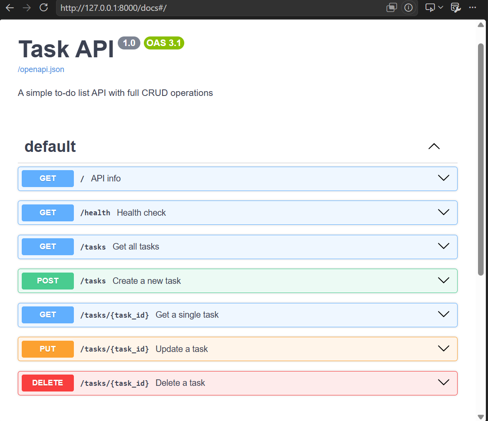

# Task API

A simple to-do list REST API built with FastAPI and Python.

## How to run

```bash
pip install fastapi uvicorn
uvicorn main:app --reload
```

Visit `http://localhost:8000/docs` for the interactive Swagger UI.

## Endpoints

| Method | Path | Description | Status Code |
|--------|------|-------------|-------------|
| GET | / | API info | 200 |
| GET | /health | Health check | 200 |
| GET | /tasks | Get all tasks | 200 |
| GET | /tasks/{id} | Get one task | 200 / 404 |
| POST | /tasks | Create a task | 201 / 400 |
| PUT | /tasks/{id} | Update a task | 200 / 404 |
| DELETE | /tasks/{id} | Delete a task | 204 / 404 |

## Example

```bash
curl -i -X POST http://localhost:8000/tasks \
  -H "Content-Type: application/json" \
  -d '{"title": "Buy milk"}'
```

## Swagger UI



## Notes

Data is stored in memory only. Restarting the server resets all tasks.
This is intentional — a real database comes next week.