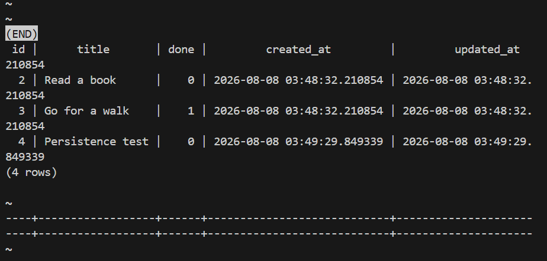

# Task API — A3: Containerized Postgres Stack

A FastAPI task CRUD API backed by PostgreSQL running in Docker.
This is the third storage swap in the same repo: memory (A1) → SQLite (A2) → Postgres in Docker (A3).
Routes and service are unchanged — only `database.py` was swapped.

## How to run (one command)

```bash
cp .env.example .env
docker compose up --build
```

API is available at http://localhost:8000

## Environment variables

Copy `.env.example` to `.env` and fill in your values:

| Variable | Example | Description |
|---|---|---|
| DATABASE_URL | postgresql://postgres:dev@db:5432/tasks | Postgres connection string |

## Endpoints

| Method | Path | Status | Description |
|---|---|---|---|
| GET | /tasks | 200 | Get all tasks |
| GET | /tasks/{id} | 200 / 404 | Get one task |
| POST | /tasks | 201 / 400 | Create a task |
| PUT | /tasks/{id} | 200 / 404 | Update a task |
| DELETE | /tasks/{id} | 204 / 404 | Delete a task |

## Example request

```bash
curl -i -X POST http://localhost:8000/tasks \
  -H "Content-Type: application/json" \
  -d '{"title": "My first task"}'
```

## Persistence proof

1. Started stack with `docker compose up`
2. Created tasks via POST /tasks
3. Ran `docker compose down` — stopped all containers
4. Ran `docker compose up` again
5. GET /tasks returned all rows including ones created before restart
Data survives because Postgres writes to a named Docker volume (`taskdata`),
not inside the container. `docker compose down` stops containers but keeps volumes.

## Architecture

- `main.py` — FastAPI routes (unchanged from A1/A2)
- `database.py` — Postgres repository (only file that changed from A2)
- `docker-compose.yml` — defines `api` and `db` services
- `Dockerfile` — builds the FastAPI app image
- `.env` — gitignored secrets
- `.env.example` — committed placeholder for collaborators
## Database screenshot

